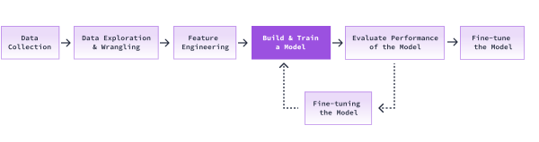

We have our training data ready! We can now train a model.

scikit-learn offers m[any machine learning models](https://scikit-learn.org/stable/supervised_learning.html). We can pick any one of the classification models and use it out of the box.

That's exactly what we'll do. We'll use the [Linear Support Vector Classification](https://scikit-learn.org/stable/modules/generated/sklearn.svm.LinearSVC.html) model. We can check the documentation to see what kind of input parameters it can take. scikit-learn makes it easy for us to use the model without needing to understand the minute details of the algorithm. We'll observe this soon.

There are only two steps for building and training the model:

1. We first instantiate the model. This is similar to how we would instantiate a Python class.

    - This step doesn't take any training data as input. We can, however, define and set the values for the parameters we saw in the documentation linked above.

2. We fit the model onto the training data features (X) and labels (y). Fitting the model is the same as training our model.

### Instructions
1. From sklearn.svm import LinearSVC
2. Create an instance of LinearSVC and assign it to model. Pass the following parameters when instantiating:
    - penalty="l2"
loss="squared_hinge"
    - C=10
    - random_state=417
    - This ensures that the result is reproducible.
3. Call model.fit() and pass the following parameters to the function:
    - X_train
    - y_train