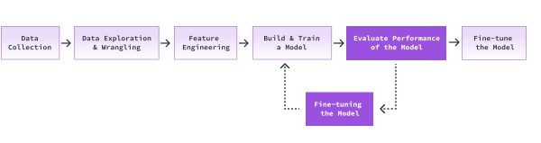

## Evaluating the model on the test set

We have successfully trained our model! But we don't know how well it performs.

How can we measure the performance of a model?

One of the most common ways to evaluate a classifier is to look at how accurate its predictions are. For a supervised learning task, we already know which class a particular observation belongs to.

We can use our model to predict the labels of our test data. We can then calculate the accuracy of our model by comparing those predictions to the actual labels. But we don't need to do that all by ourselves.

scikit-learn provides a method [score()](https://scikit-learn.org/stable/modules/generated/sklearn.svm.LinearSVC.html#sklearn.svm.LinearSVC.score) that can calculate that accuracy.

### Instructions
1. Call model.score(), assign it to test_accuracy, and pass in the following parameters:
    - X_test
    - y_test
2. Print out the accuracy score obtained from the above function call.