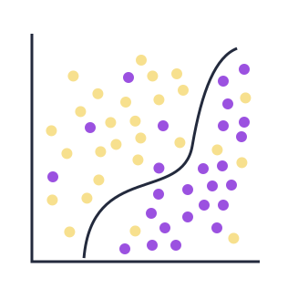
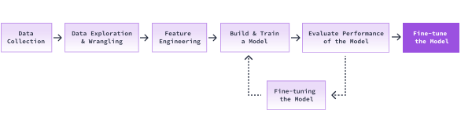

## Evaluate the model on the test set II

In the last screen, we fine-tuned our model. We don't know yet if that improved our model's performance.

Before we evaluate our model on the test set, let's look at the following plot:

We can notice that there are yellow dots on the left side and there are purple on the right side of the decision boundary. The above is meant to be a simplified representation of how the decision boundary can't always capture the complexity of the data.

What happens when we add a point to the above plot? Will it be correctly classified?

We can't be sure. Our model is not going to be perfect. It's not going to give us a 100% accuracy, even if we keep experimenting with different parameter values.

Let's see how our updated model performs on the test set.

### Instructions

1. Call model.score(), assign it to test_accuracy, and pass in the following parameters:
    - X_test
    - y_test
2. Print out the accuracy score obtained from the above function call
