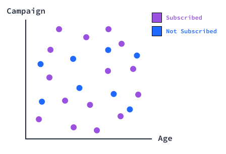
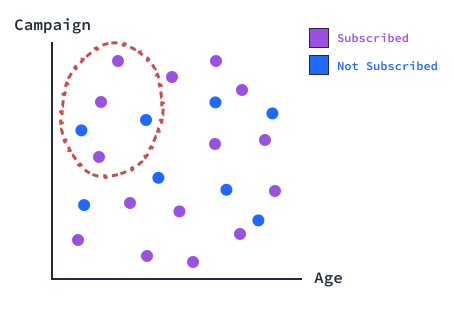

### K-Nearest Neighbors

Upon exploring the data, we discovered that the dataset has:

- 10122 observations, 20 features, and 1 target variable.
- No missing values in the dataset.
- 5482 customers who didn't subscribe and 4640 who did.
- 10 categorical columns and 10 numeric columns, excluding the target column.

If we explore our dataset further, we could ask several questions to better analyze it. For example:

- How many customers under the age of 30 subscribed to the product?
- Were the customers who subscribed contacted more often than those who weren't during the marketing campaign?
- Which customers were contacted more often before this campaign?
We could potentially answer each of these questions ourselves and develop a complex set of rules that could tell us which customers are likely to subscribe given all the features available to us.

Let's look at a visual representation of the above. The following plot depicts customers who subscribed (purple) and those who didn't (blue). Our two axes correspond to two features. For example, one could be age and another campaign.

Each customer is a data point in a 2-dimensional feature space and is defined by two numerical values. If we know the age of a customer and how many times they were contacted during the campaign, we can locate that point in that space.

The proximity of those customers in the feature space can tell us how similar they are to one another in relation to their label. For example, let's say that 3 out of 5 customers who are 30 to 32 years old and were contacted 2 to 4 times during the campaign subscribed to the product. In the plot, the data points for those customers would be relatively close to one another. We could say that customers within that age and campaign range of values are more likely to subscribe to the bank's product.

That's the kind of rule we could develop through our analysis and by looking at the data points in the feature space.

What if we add another customer (blue dot) to our feature space above?