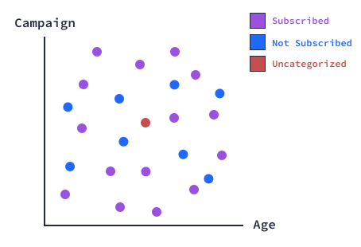
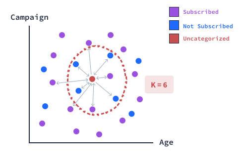

### K-Nearest Neighbors II

How can we predict if this new customer is going to subscribe, given just those two features?

With what we learned above, we can calculate the distance of that blue dot from all the other points and look at the ones closest to it. If a majority of the points closest to it are purple, we can classify the new point as purple. If they are blue, we can classify it as blue.

By looking at how closely-related those data points are in context of their labels, we are allowing those rules, like the ones we mentioned above, to develop on their own. This is the K-Nearest Neighbors algorithm.

For an unseen data point, the algorithm calculates the distance between that point and all the observations across all features in the training dataset.

It sorts those distances in ascending order.

It selects K observations with the smallest distances from the above step. These K observations are the K-nearest neighbors of that unseen data point.

Note that there should be at least 
K
≥
1
 observations in the dataset.
It calculates which labels of those neighbors is the most common, and assigns that label to the unseen data point.

Before we implement the algorithm, let's prepare our data.