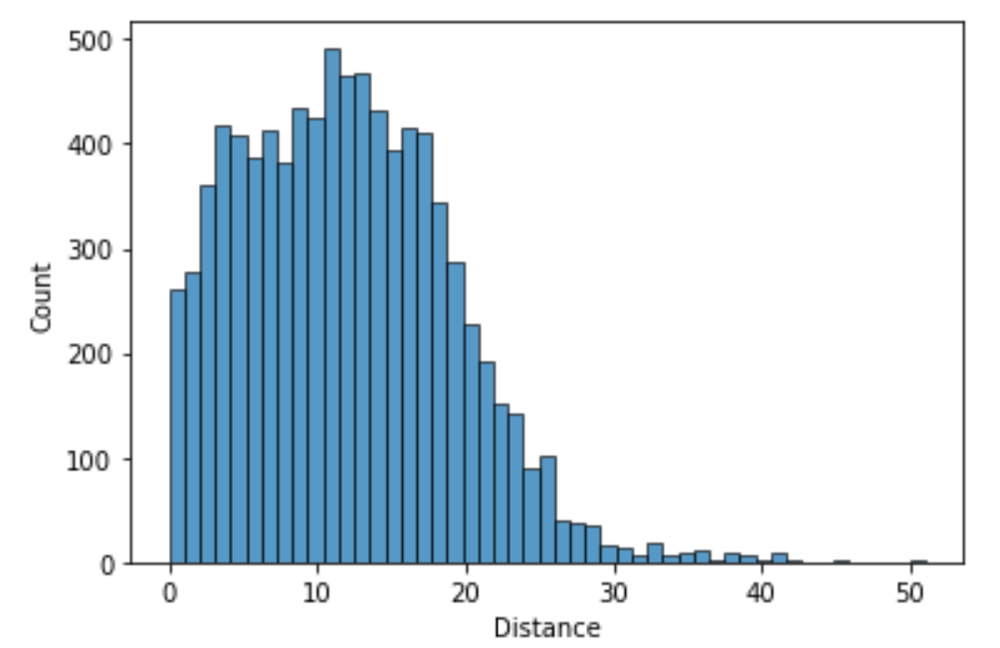
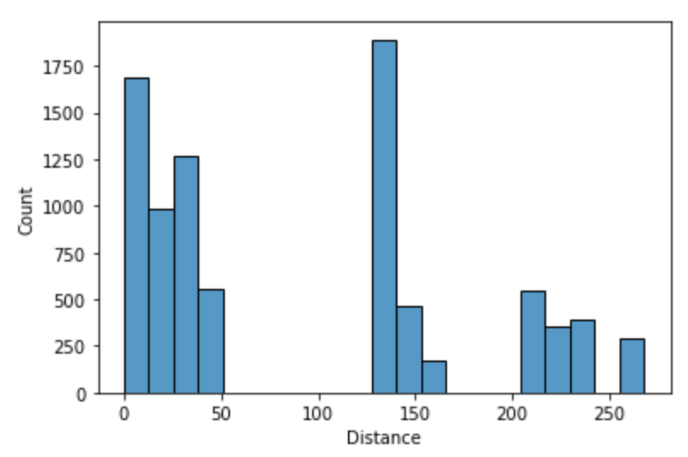

## Feature Engineering 3

On the previous screen, we calculated the distance between multiple features. Let's look at how the distance column we created is distributed in two different situations.

If we only used the features age and campaign, the distance column, when calculated using a single data point, would have the following distribution:

Now, what if we used `age` and `nr.employed`?

The distance calculated using `age` and `nr.employed` has a lot of variation in its values. There are distance values in the range `125` to `160` and also in the range `200` to `280`. In contrast, most of the distance values for `age` and `campaign` are between `0` and `20`.

If we go back to our summary statistics, we notice that the maximum value in `nr.employed` is `5228`, while the maximum of `age` is only `98`. Any distance calculated using the two will result in a large value because of `nr.employed`.

That wouldn't yield a fair estimate of the similarity between two observations. Especially when we add more features into the mix. One feature will continue to have a larger contribution to the distance calculation, and that could negatively impact our model's performance.

In order to address this, we can normalize our features by rescaling their values to a specific range. One common approach is to normalize the features to the range [0, 1]; this is called min-max scaling or min-max normalization.

We can scale our features using the following formula:

$x' = \frac{x - min(x)}{max(x) - min(x)}$

Where:
- $x'$ is the scaled value.
- $x$ is the original value of the feature.

It's crucial to remember that when you scale the features in your training dataset, you need to save these parameters (`min(x)` and `max(x)` in this case). The reason is that we need to apply the same scaling to our test dataset as well. We must use the summary statistics from the training data to scale the test data. This ensures that the model sees the test data on the same scale as the training data, allowing for consistent interpretation and performance.

In this final exercise, we'll normalize our `age` and `campaign` features using the min and max values from our training data and implement the algorithm using the same features as before.

Note that the distance values calculated using `age` and `campaign` do not vary drastically. Even with normalization, our model might not show a significant improvement. However, this standard practice of scaling ensures that our model's performance remains consistent across both training and test sets.

## Instructions
1. Using the formula discussed above, normalize `age` and `campaign` so their values are between `0` and `1`.
    - Make sure to normalize the columns in the training set as well as the test set using the same summary statistics values from the training set.
    - Replace the `age` and `campaign` columns with their normalized versions.
2. Use knn() for every row in X_test with the following arguments:
    - features = ["age", "campaign", "marital_married", "marital_single"].
    - k = 3.
3. Store the predictions in a new column, predicted_y, in X_test.
4. Compare predicted_y to y_test and calculate the number of correct predictions.
5. Calculate and print the accuracy of the model.